# Attractor から取り入れる点の検討 — テスト自動化パイプラインへの適用提案

作成: 2026-09-22 / 対象: ステップ1(単機能シナリオ)パイプライン一式
参照元: strongdm/attractor NLSpec 群 および StrongDM Software Factory の原則・技法

---

## 0. 結論(先に要約)

Attractor の本質は「DOT を使うこと」ではなく、**ワークフローを、手順の自然文ではなく〈離散状態 + 遷移条件 + 到達すべきゴール〉として書き、AIに手順ではなく到達条件を渡すこと**にある。DOT はその表現手段にすぎない。

本パイプラインは、この方向に**すでに7割方到達している**。判定4値・理由コード8種・review_status 3値・検証手段3値・KBカテゴリT01〜T11といった統制語彙を持ち、成果物を機械可読なYAML(exploration-log)で受け渡し、オラクルを外部(scenarios.md)に置いている。これは Attractor / Software Factory の設計と偶然ではなく収斂している。

**欠けているのは1点に集約できる。それらの離散値が「報告書の自然文の中」にあり、「次段の起動条件を決める機械可読な状態ファイル」になっていないこと。** 結果として、段階間の受け渡しと分岐判断を人間が読んで行っており、そこがボトルネックかつ曖昧さの発生源になっている。

優先度順の提案:

| # | 提案 | 効果 | コスト |
|---|---|---|---|
| **A** | 各段階に **完了条件(DoD)チェックリスト** と **status.yaml** を導入する | 曖昧さ除去・自律性向上・自動分岐の前提 | 小 |
| **B** | 実行順序・分岐・停止点を **pipeline.dot** に集約し、各指示書から順序記述を削除する | 指示文圧縮・正確性向上・図として説明資料に転用 | 小 |
| **C** | **ゴールゲートと差し戻し先**を明示し、収束まで回す構造にする | 成熟度 Level 3 → 4 の中核 | 中 |
| **D** | DoD と同じ内容を **lint スクリプト**として実装し、次段の起動前提にする | 規約の実効化 | 中 |
| **E** | **既定値+差分記述**への文書再編(語彙単一ソース化、ゴールド例の埋め込み) | 指示文圧縮(最大の削減効果) | 中 |
| **F** | **コンテキスト忠実度とモデル割り当ての宣言化** | トークンコスト統制 | 小 |
| G | (条件付き)機器・AD・SMTP の **振る舞いクローン(Digital Twin)** | `状態未整備`/`操作手段なし` の解消 | 大 |
| × | Attractor ランナーの本格実装、「コードを人間がレビューしない」原則 | — | 採らない |

---

## 1. Attractor 側の要点整理(何が効いているのか)

### 1.1 グラフが仕様そのものである

`.dot` ファイルはワークフローの絵ではなくプログラムである。ノード=処理、エッジ=遷移、属性=設定。Graphviz で描画でき、差分が取れ、レビューできる。

**効いている理由は「図になること」ではなく、「グラフに書ける形に落とすには、分岐が依存する状態変数を名前付きで定義しなければならない」という強制力にある。** 自然文の「〜が多ければ〜する」は、グラフでは `context.rediscovery_rate=high` のような離散値を定義しない限り書けない。

### 1.2 条件式が意図的に貧弱である

エッジ条件は `=` / `!=` / `&&` の3つしかない。`>`、正規表現、OR は仕様上ない。

これは制約ではなく設計判断である。**判断はノード(AI)の中で行い、エッジは判断結果の列挙値でルーティングするだけ**という役割分離を強制している。ルーティングが決定的・検査可能になる。

### 1.3 status.json 契約

各ノードは実行ディレクトリに `status.json` を書く。

```json
{ "outcome": "success|partial_success|retry|fail",
  "preferred_label": "...",
  "suggested_next_ids": ["..."],
  "context_updates": { "key": "value" },
  "notes": "..." }
```

エンジンはこれだけを読んでルーティングする。**外部のツールやエージェントがこのファイルを書けば、そのままパイプラインの一部になる。** 実装非依存の結合点であり、本件のように別AI(Kiro)が実行を担う構成と相性が極めて良い。

### 1.4 ゴールゲートと差し戻し先

`goal_gate=true` のノードは、SUCCESS または PARTIAL_SUCCESS に達するまでパイプラインの終了を許さない。終了ノードに到達しても、未達のゲートがあれば `retry_target` のノードへ戻る。

**これが「人間が再実行する」を「パイプラインが自分で収束する」に変える唯一の機構である。**

### 1.5 PARTIAL_SUCCESS という状態

「完了したが積み残しがある」に名前が付いている。`allow_partial=true` でリトライ枯渇時に許容する。二値(成功/失敗)では表現できない状態を扱える。

### 1.6 コンテキスト忠実度

`full` / `truncate` / `compact` / `summary:low|medium|high` をノードまたはエッジ単位で指定する。次段にどれだけ文脈を持ち越すかを**宣言する**。長い連鎖のトークンコストを設計対象にしている。

### 1.7 モデルスタイルシート

CSS 風のセレクタ(`*` / shape / `.class` / `#id`)でノードごとの使用モデル・reasoning_effort を一括指定する。各ノードに書かない。

### 1.8 実行前バリデーション(lint)

開始/終了ノードの存在、到達可能性、エッジ先の存在、条件式の構文、prompt の有無などを ERROR/WARNING/INFO で診断し、**ERROR があれば実行を拒否する**。

### 1.9 NLSpec の書き方そのもの

仕様書の末尾に **Definition of Done(チェックボックス)** と **Cross-Feature Parity Matrix(全セルが pass すべき検証表)** を置いている。つまり仕様が自分自身の合格判定基準を内蔵している。手順の記述ではなく、**受け入れ条件の記述**が主である。

### 1.10 Software Factory 側の技法(Attractor の背景思想)

| 技法 | 内容 |
|---|---|
| Scenario(≠ Test) | ユーザーストーリーをコードベース**外**に置く。機械学習の holdout 集合と同じ発想。コードに合わせてテストを書き換えられないようにする |
| Satisfaction | 「テストがグリーン」という二値ではなく、「全トラジェクトリのうち何割がユーザーを満足させたか」という確率的・経験的指標 |
| Digital Twin Universe | 依存する外部サービスの振る舞いクローンを作る。本番では不可能な量・失敗モードを決定的・再現可能に検証する |
| Gene Transfusion | 具体的な実例(exemplar)をエージェントに示すことで、動作するパターンを別文脈へ移植する |
| Shift Work | 対話が必要な作業と、仕様が完成していて無人実行できる作業を分離する |
| Pyramid Summaries | 可逆的な多段階要約。圧縮しても元の詳細へ展開できる |
| The Filesystem | ディレクトリ・索引・ファイルをモデルの実用的な記憶基盤として使う |

---

## 2. 現行パイプラインとの対応

### 2.1 すでに実現できているもの(変更不要・むしろ設計の裏付け)

| Attractor / Factory 側 | 本パイプラインの該当 |
|---|---|
| Scenario を codebase 外に置く(holdout) | `scenarios.md` は `work/` 配下、テストコードは `tests/` 配下。**20で期待結果の書き換えを明示的に禁止**している |
| 条件式に使う値が列挙型 | 判定4値 / 理由コード8種 / review_status 3値 / 検証手段3値 / 進捗軸3値 |
| The Filesystem | KB(`kb/` T01〜T11)+ 索引経由参照、申し送り台帳、要確認事項台帳 |
| Pyramid Summaries | KB は「索引 → エントリ → 文書へのポインタ(転記禁止)」の3層 |
| Shift Work | フェーズ0(パイロット・必ず停止)/ フェーズ1(横展開) |
| Gene Transfusion | 「パイロットで実物を1本作り few-shot 例として05に埋め込む」(未着手) |
| 観測可能性 | 探索記録・DISC・申し送り台帳・完了報告。説明資料 §4.2④ で自ら要件として挙げている |
| PARTIAL_SUCCESS の思想 | 「申し送り件数が多いことは失敗ではなく、粗い網に留まっている証拠」 |

**この一致は偶然ではない。** 長期運用のオンプレ資産に対して自律的にAIを回す、という同じ問題を解いた結果の収斂である。したがって Attractor は「異質な思想の輸入」ではなく「同じ方向の先行事例」として扱える。

### 2.2 欠けているもの

| 欠けている機構 | 現状 | 起きていること |
|---|---|---|
| **機械可読な段階間契約** | 完了報告(report.md)15セクションの自然文 | 次段の入力(コード化対象リスト等)を自然文から読み取っている。曖昧さとコストの主因 |
| **明示的な完了条件** | 手順(S1〜S7)と出力形式の記述が中心 | 「この段階が終わった」の判定が暗黙。AIが自己検査できない |
| **ゴールゲートと差し戻し** | 「コード化不能・要差し戻し」を報告書に書く | 人間が気づいて再実行する。自動収束しない |
| **順序・分岐の単一ソース** | 000 と 00 に表、各指示書の冒頭にも記述 | 同じ順序が複数ファイルに散在し、改訂時に波及管理が必要 |
| **規約の実効性** | 規約は文章、遵守はAI頼み | 違反しても止まらない |
| **文脈量とモデルの制御** | 各作業に 00 + 指示書 + KB を渡す | トークンコストが設計対象になっていない(説明資料 §4.2⑤ で自ら課題に挙げている) |

---

## 3. 提案

### 提案A(最優先)— 完了条件(DoD)と status.yaml の導入

#### A-1. 各段階の末尾に Definition of Done を置く

現行の指示書は「何をするか」が厚く、「終わったと言える条件」が薄い。Attractor の NLSpec に倣い、各指示書の末尾に**チェックボックス形式の完了条件**を置く。AIはこれを埋めて提出する。

10(探索的実行)の例:

```markdown
## ■ 完了条件(DoD) — 全項目を満たすまで完了報告を出さない

- [ ] scenarios.md の全シナリオIDが exploration-log に1件ずつ存在する(過不足なし)
- [ ] 全シナリオ・全ステップの判定が `passed`/`failed`/`human-check`/`blocked` のいずれか
- [ ] `failed` / `human-check` の全件に evidence パスがある
- [ ] `verification: 両方` の全ステップに screen と db の双方の確認内容が書かれている
- [ ] `verification: DB` の全ステップに理由が1文ある
- [ ] 非同期待機を行った全ステップに `measured_seconds` がある
- [ ] 全ステップに `assertion_hint` がある(決定的手段がない場合はその旨を明記)
- [ ] `assertion_hint` が自データスコープで書かれている(全体件数を判定基準にしていない)
- [ ] 使用した全 `operation_id` がKB T05に登録済みである
- [ ] 申し送り記録の理由コードが統制語彙8種のいずれかである
- [ ] INV-001〜005 の結果が記録されている(未実施の場合は理由を記載)
- [ ] status.yaml を出力した
```

**この12行は、現行の散文規約から機械的に抽出できる。新しい制約を課すものではなく、既存の規約を検査可能な形に写したものである。**

#### A-2. status.yaml(機械可読な段階間契約)

report.md(人間向け)とは別に、**次段のAIと将来のランナーが読む小さなファイル**を各段階が必ず出す。

```yaml
# work/<feature_code>/<stage>/status.yaml
stage: "10"
feature_code: PRT
phase: pilot                 # pilot / rollout
outcome: partial_success     # success / partial_success / retry / fail
review_status: unreviewed

context_updates:
  invariant_violation: none          # none / found        ← 分岐に使う
  escalation: none                   # none / unregistered_op / data_change
  traceability_unmatched: 0
  verdicts:        { passed: 12, failed: 1, human_check: 2, blocked: 0 }
  handoff_by_reason:
    同一経路: 4
    異常系: 8
    基本操作外: 3
    初期状態外: 3
    状態未整備: 1
    操作手段なし: 2
    禁止操作: 0
    E2E非効率: 1
    判定不能: 0
  rediscovery_rate: 0.18
  codeable_items: [SC-PRT-01, SC-PRT-02, SC-PRT-04]

inputs_review_status:                # 00の切り分けプロトコル用
  scenarios.md: unreviewed
  nondeterministic-catalog.md: reviewed

artifacts:
  report: work/PRT/10/report.md
  exploration_log: work/PRT/10/exploration-log.yaml
  evidence_dir: work/PRT/10/evidence/

notes: "DISC-PRT-001(マニュアル4-2の印刷設定画面が実画面に存在しない)"
```

得られるもの:

1. **20の入力である「コード化対象リスト」が、報告書の読解ではなく `codeable_items` の読み取りになる。** これだけで曖昧さと工数の主因が消える。
2. 分岐条件がすべて**名前付きの列挙値**になる(`invariant_violation`, `escalation`, `traceability_unmatched`)。提案B・Cの前提。
3. 理由コード別集計がそのままステップ2・3の投資計画の入力になる(既存の設計意図が機械可読になる)。
4. 将来の差分検知トリガー(Level 4)の入出力がこのファイル1つで済む。

**report.md は廃止しない。** 人間の判断材料(見立て、優先レビュー推奨、改善提案)は自然文でなければ表現できない。役割を分ける — **status.yaml は機械のため、report.md は人間のため。**

---

### 提案B — pipeline.dot への順序・分岐の集約

#### B-1. なぜ DOT か

本件で DOT を採用する理由は3つある。

1. 順序・分岐・停止点・差し戻し先が**1ファイルに集約**され、000 と 00 と各指示書冒頭の重複が消える(波及管理の対象が1つになる)
2. Graphviz でそのまま図になり、**説明資料の §2 の表・§4 のロードマップ図に転用できる**
3. 将来ランナーを書くなら、そのまま実行定義になる(書かなくても損はしない)

#### B-2. 現行パイプラインの DOT 表現(たたき台)

```dot
digraph pms_e2e_step1 {
  graph [
    goal  = "PMS全機能の基本動作を、シナリオ型E2Eで機械的に検証できる状態にする",
    label = "ステップ1(単機能シナリオ)",
    default_fidelity = "compact",
    model_stylesheet = "
      *        { reasoning_effort: high }
      .text    { llm_model: <長文・安価モデル> }
      .operate { llm_model: <UI操作・マルチモーダルモデル> }
    "
  ]
  rankdir = LR
  node [shape=box, timeout="14400s"]

  start [shape=Mdiamond, label="開始"]
  exit  [shape=Msquare,  label="終了"]

  // 事前準備(人間)
  forbid [shape=hexagon, type="wait.human", label="90 禁止操作リスト記入"]

  // 任意・随時
  kb  [label="01 知見蓄積",         class="text,operate"]

  // 本線
  nd  [label="02 非決定値カタログ", class="operate"]
  gen [label="05 シナリオ生成",     class="text"]
  exp [label="10 探索的実行",       class="operate",
       goal_gate=true, retry_target="gen", allow_partial=true]
  cod [label="20 回帰コード生成",   class="text",
       goal_gate=true, retry_target="exp"]
  cat [label="30 状態カタログ案",   class="text"]

  // 判定・停止点
  pilot [shape=diamond, label="フェーズ0か?"]
  p0rev [shape=hexagon, type="wait.human", label="フェーズ0 報告レビュー"]
  invq  [shape=diamond, label="INV違反あり?"]
  halt  [shape=hexagon, type="wait.human", label="不変条件違反 — 人間判断"]
  esc   [shape=hexagon, type="wait.human", label="未登録/禁止操作 — エスカレーション"]

  start -> forbid -> nd
  nd  -> gen   [condition="outcome=success"]

  gen -> pilot
  pilot -> p0rev [condition="context.phase=pilot"]
  pilot -> exp   [condition="context.phase=rollout"]
  p0rev -> gen   [label="[F] 手順を修正して再実行"]
  p0rev -> exp   [label="[A] 承認して続行", weight=10]
  p0rev -> exit  [label="[S] 中断"]

  exp -> esc   [condition="context.escalation!=none"]
  esc -> exp   [label="[R] KB T05へ登録して再開"]
  esc -> exp   [label="[G] 申し送りに回して続行", weight=5]

  exp -> invq  [condition="context.invariant_violation=none"]
  exp -> halt  [condition="context.invariant_violation=found"]
  halt -> cod  [label="[C] 不具合として起票し続行"]
  halt -> exit [label="[S] 中断"]
  invq -> cod

  cod -> cat [condition="context.traceability_unmatched=0"]
  cod -> exp [condition="context.traceability_unmatched!=0", label="差し戻し"]

  cat -> exit
}
```



約45行。これが置き換える現行記述は、000 §2(ファイル一覧と実行順序の表)、000 §4(進め方の推奨順序)、00 の「パイプライン上の位置づけ」表、各指示書冒頭の「②の完了報告後に実行する」等の記述、およびエスカレーション経路の散文である。

#### B-3. 注意点(仕様を正確に読んだ上での)

- **goal_gate は「実際に訪問したノード」のみを検査する。** 上記の `[S] 中断` で exit に入ると、`exp`/`cod` が未訪問のため終了は成功扱いになる。中断は `outcome: fail` を実行記録に残し、達成と区別すること。
- **条件式は `=` / `!=` / `&&` のみ。** `rediscovery_rate > 0.3` は書けない。閾値判定はノード側で行い、`rediscovery_rate_level: high|normal` のような離散値を status.yaml に出す。**この制約は本件では利点である** — 統制語彙の運用と同じ規律だから。
- 並列実行(`component` / `tripleoctagon`)は、**テキスト処理段階(05・20)にのみ適用可能**。10(探索的実行)の並列化は、VMが1台であること、およびINVの全体検査がスイート終端の静穏状態を前提にしていることから、環境を増やすまで適用してはならない。

---

### 提案C — ゴールゲートと差し戻しによる自律収束

これが成熟度を上げる中核である。

現在、「20でコード化不能 → 報告書に記載 → 人間が読む → 10を再実行するか判断」という経路は**人間を経由しないと閉じない**。これを次のように変える。

| ゲートノード | 満たすべき条件 | 未達時の差し戻し先 |
|---|---|---|
| 10 探索的実行 | 対象シナリオの全件が4値判定を持ち、`blocked` が閾値未満 | 05(シナリオ生成) |
| 20 コード生成 | `traceability_unmatched = 0`(passed項目とコードが1対1) | 10(探索的実行) |

差し戻しのたびに前段のAIは「前回どこで不足したか」を status.yaml 経由で受け取る。**これは自然文の報告を読むのではなく、構造化された不足リストを受け取る形になる。**

適用してはならない箇所(重要):

- **INV違反は差し戻しではなく人間ノードへ。** 不変条件違反は製品不具合の可能性が最も高い事象であり、自動リトライで揉み消してはならない。
- **`failed` / `human-check` の as-is 凍結判断は引き続きAIにさせない。** 現行方針を維持する。誤った挙動を回帰の正解として固定するリスクは自律化の利得を上回る。
- **VM復元を伴う再実行の自動リトライは回数を1に制限する。** 復元コストが高い。

---

### 提案D — lint(実行前検証)

**DoD チェックリスト(提案A-1)と lint は同じ内容を2度書かない。** DoD を書けば lint の仕様が決まる。

| ルールID | 重大度 | 内容 |
|---|---|---|
| `scenario_id_exists` | ERROR | exploration-log / traceability の全シナリオIDが scenarios.md に存在する |
| `verdict_enum` | ERROR | 判定値が4値のいずれか |
| `reason_code_enum` | ERROR | 申し送り理由コードが統制語彙8種のいずれか |
| `operation_registered` | ERROR | 使用 `operation_id` が KB T05 に登録済み、かつ禁止操作リストに載っていない |
| `review_header_valid` | ERROR | 全成果物にレビューヘッダがあり値が3値のいずれか |
| `traceability_complete` | ERROR | passed 項目とテストコードが1対1で対応する |
| `db_only_has_reason` | WARNING | `verification: DB` に理由が併記されている |
| `assertion_hint_present` | WARNING | 全ステップに assertion_hint がある |
| `measured_wait_present` | WARNING | 非同期待機ステップに実測秒がある |
| `self_scoped_assertion` | WARNING | assertion_hint が全体件数を判定基準にしていない |
| `evidence_on_failure` | WARNING | failed / human-check に evidence がある |
| `no_fixed_wait` | ERROR | 生成コードに `waitForTimeout` 等の固定待機がない |
| `select_only` | ERROR | 生成コード・実行SQLに SELECT 以外がない(ステップ1) |
| `rediscovery_rate` | INFO | 再発見率を出力(次の01の対象選定用) |

**ERROR が1件でもあれば次段を起動しない。** 現在の「規約を書いてあるが守られたかは事後にしか分からない」状態から、「守られていなければ進まない」状態になる。

overview に「lintスクリプト整備(推奨済み、未着手)」とある項目に、具体的な仕様を与えるものである。

---

### 提案E — 文書の再編(指示文圧縮の本体)

DOT 化による圧縮は実は副次的である。**最大の削減は「既定値 + 差分記述」への移行で得られる。**

Attractor の DOT は、グラフ既定値 → subgraph 既定値 → ノード属性 → スタイルシート、という**多段の既定値と上書き**で成り立っている。各ノードは既定と異なる点だけを書く。`prompt` が空なら `label` を使う、という縮退まで用意されている。

現在、以下が複数ファイルに繰り返し記述されている(検索で確認した範囲):

| 重複している内容 | 出現箇所 |
|---|---|
| ステップ1/2/3の構成表と「扱わないもの」 | 000, 00 |
| オラクル原則 | 000, 00, 01 |
| 非ブロッキングレビュー方針 | 000, 00, 01, 10, 20 |
| 理由コード一覧 | 000, 00, 05, 10, 91 |
| 検証手段(画面/DB/両方)の規約 | 000, 00, 10 |
| プロトタイピング原則(フェーズ0/1) | 000, 00, 01, 10, 30 |
| 実行順序 | 000(2箇所), 00, 01 |

再編方針:

1. **`vocab.yaml` を単一ソースにする** — 判定値、理由コード、review_status、検証手段、進捗軸、KBカテゴリ、操作IDフォーマット、INV-ID。各指示書は**IDを参照するだけ**で、定義を再掲しない。lint もこのファイルを読む。
2. **順序・分岐は `pipeline.dot` のみ**(提案B)。指示書から「②の完了報告後に実行」等の記述を削除する。
3. **共通規約(00)を「既定」、各指示書を「差分」にする。** 各指示書が書くのは、役割 / 入力 / 手順 / その段階固有の禁止事項 / DoD の5つだけ。原則の再掲は禁止とする。
4. **出力形式の散文説明を、ゴールド例1件に置き換える**(Gene Transfusion)。exploration-log.yaml の書き方を段落で説明するより、完全な実例を1本置くほうが短く、かつ曖昧さが少ない。「シナリオ粒度の基準例をパイロットで作り few-shot として埋め込む」という既存の計画を、**全成果物種別に一般化する**。
5. **報告書に固定長のヘッダ要約を義務づける**(Pyramid Summaries)。現行の15セクションは、後段が必要な部分だけ読めるよう、先頭に5行の要約と各セクションへのポインタを持つ。KBで既に実践している「索引経由参照」を報告書にも適用する。

---

### 提案F — 文脈量とモデル割り当ての宣言化

| 区間 | 推奨 fidelity | 理由 |
|---|---|---|
| 10 の中(同一機能のシナリオ間) | `full`(同一スレッド) | 画面遷移・ロケータの知見が連続して効く |
| 10 → 20 | `compact` | 受け渡すのは exploration-log と status.yaml という**成果物**であり、対話履歴ではない |
| 機能をまたぐ横展開 | `truncate` + KB参照 | 機能間で対話履歴を引き継ぐ理由がない |
| 02 → 05 | `summary:low` | カタログというファイルが成果物 |

モデル割り当ては提案BのDOT内 `model_stylesheet` に集約する(`.operate` はUI操作を伴う10・02、`.text` はテキスト処理のみの05・20・30)。

説明資料 §4.2⑤「コスト・実行時間の管理」に対する具体的な着手点になる。「回帰実行にはAIを使わない」という既存の原則がコスト統制の要であるのと同様に、**生成側のコストも宣言的に統制する**。

---

## 4. Software Factory 側から追加で取り込める視点

### 4.1 Satisfaction — 二値ではない進捗指標

現在、ステップ1の進捗は「機能数の消化」と「申し送り件数」で語られている。後者には「多くても失敗ではない」という但し書きが必要で、単独の指標として使いにくい。

**機能あたりの満足度**を定義すると、1つの数字で報告できる。

```
satisfaction(feature) =
    (verdict=passed かつ verification=両方 のステップ数)
  / (そのfeatureの全ステップ数)
```

`human-check` と `blocked` は分子に入らないため、オラクル不能と環境制約が自動的に減点される。機能別の分布が、ステップ2・3の投資先の地図になる。

### 4.2 Digital Twin — 申し送り台帳が投資順位を決めている

Software Factory の主張の核は「**SaaS の振る舞いクローンを作ることは、以前は経済的に不可能だったが、エージェントによって routine になった**」という点である。

本件で該当するのは、複合機/プリンタ、AD、SMTP である。理由コード `操作手段なし` `状態未整備` `禁止操作` に分類された項目は、**そのままどのツインを先に作るべきかの優先順位表になっている。** 既にステップ3の候補として「機器シミュレータによる異常注入(クラッシュ・ログ溢れ・重複・順序逆転)」を挙げており、方向は一致している。

Attractor 側が追加するのは「いつやるか」の判断材料である — 申し送り台帳の理由コード別件数が閾値を超えた時点が着手時期であり、判断は既存の仕組みから自動的に出てくる。

ただし本件の機器は**物理機器であり SaaS API ではない**。ツインの忠実度(PDL処理、ジョブ状態遷移、課金に効くページカウント)をどこまで作るかが成否を分けるため、着手はステップ1完了後、かつ課金に効く範囲に限定することを推奨する。

### 4.3 Shift Work — フェーズ1を無人実行にする

フェーズ0/1の分離は既にある。**足りないのは「フェーズ1に入ってよい条件」が機械的でないこと。**

提案A(DoD)+ 提案D(lint)が揃えば、「フェーズ0のDoDが全項目満たされ、lintがERROR 0」という条件でフェーズ1を無人起動できる。夜間に横展開を回し、翌朝 status.yaml の集約だけを見る、という運用が成立する。**これが成熟度を上げるという問いへの最も実務的な答えである。**

### 4.4 「コードを人間がレビューしない」は採らない

Software Factory の原則は「コードは人間が書かない・レビューしない」である。これが成立しているのは、外部の scenario 群と DTU による検証が代替しているからである。

本件は以下の理由で採らない:
- 課金機能は金額の僅かなズレが致命的で、オラクルの信頼性が最重要
- 外部仕様を変えないという互換性制約があり、as-is 判断の誤りが不可逆
- DTU にあたる基盤がまだない

**現行の「as-is 凍結判断はAIにさせない」「修復はPR形式で人間承認」という方針は維持する。** 自律化するのは経路であって、正解の定義ではない。

---

## 5. 成熟度(ASTM)への効き方

説明資料 §1 の Level 定義に対する各提案の位置づけ:

| 説明資料 §4.2 の課題 | 対応する提案 |
|---|---|
| ①差分検知の仕組み(閉ループの起点) | **A**(status.yaml が差分検知の入出力になる)+ **B**(再入場ノードをグラフ上に定義できる) |
| ②CI/CDへの組み込み | **D**(lint が品質ゲートそのもの)+ **A**(status.yaml を CI が読む) |
| ③self-healingの統制 | **B**(修復ノード + wait.human ゲートとしてグラフに明示)— 無審査にしない構造をグラフが保証する |
| ④エージェントの観測可能性 | **A** + 実行ディレクトリ規約(`work/<feature>/<stage>/` に status.yaml / 入力 / 出力 / 証跡を固定配置)+ checkpoint.yaml |
| ⑤コスト・実行時間の管理 | **F**(fidelity とモデル割り当ての宣言化) |

**Level 3 → Level 4 の本質的な差は「人間が再実行するか、パイプラインが収束するまで回るか」であり、それを作るのが提案C(ゴールゲート+差し戻し)である。** 他の提案はすべてその前提条件を整えるものと位置づけられる。

---

## 6. 導入順序(小さく試す)

プロトタイピング原則に従い、一度に全部入れない。

| 段 | 内容 | 検証したいこと |
|---|---|---|
| 1 | `vocab.yaml` 単一ソース化 + **10 だけ**に DoD と status.yaml を導入 | 20の入力が report.md 読解から status.yaml 読み取りに変わることの効果 |
| 2 | `pipeline.dot` を書き、000 §2/§4 と 00 の順序記述を削除。Graphviz で描画して説明資料へ | 記述の削減量と、順序理解の齟齬が減るか |
| 3 | lint を ERROR ルール5件だけで実装し、10→20 の起動前提にする | 規約違反が実際にどれだけ出るか |
| 4 | 20 のゴールゲート(`traceability_unmatched=0`)と 10 への差し戻しを**手動運用で**試す | 差し戻しループが収束するか、振動しないか |
| 5 | (任意)最小ランナーの実装 | 段1〜4で実益が確認できた場合のみ |

**段1〜4はランナーなしで成立する。** DOT は人間とAIが読む仕様として機能し、status.yaml は次段のAIが読み、lint はスクリプト1本である。ランナーは最後でよく、書かなくても段1〜4の利得は失われない。

---

## 7. 文書への波及(連動更新が必要な箇所)

| ファイル | 変更内容 |
|---|---|
| 000 パイプライン全体像 | §2 の表と §4 の推奨順序を削除し、`pipeline.dot` の描画図へ置換。改訂点セクションに本件を追記 |
| 00 共通規約 | 語彙定義を `vocab.yaml` 参照に変更。status.yaml 契約とレビューヘッダの関係を新設。DoD の書式規約を新設 |
| 01 / 02 / 05 / 10 / 20 / 30 | 冒頭の順序記述と原則の再掲を削除(00参照に)。末尾に DoD チェックリストと status.yaml 出力指示を追加 |
| 90 禁止操作リスト | `operation_id` を lint が参照するため、機械可読な表形式に統一 |
| 91 申し送り台帳 | 理由コードを `vocab.yaml` 参照に。status.yaml の `handoff_by_reason` との整合を規定 |
| 95 要確認事項台帳 | 変更なし |
| 説明資料 | §4.2 の各課題に対する具体策として本提案を反映。DOT 図をロードマップ図に転用 |
| 新規 | `pipeline.dot` / `vocab.yaml` / `lint/` / 各成果物のゴールド例 |

---

## 8. 一行でまとめると

**Attractor から取り入れるべきは DOT そのものではなく、「AIに手順を渡すのをやめ、到達条件と離散状態を渡す」という書き方である。本パイプラインは統制語彙という形で既にその素材を持っており、それを報告書の自然文から status.yaml と DoD へ移すだけで、指示文の圧縮・曖昧さの除去・自律収束の3つが同時に得られる。DOT はその状態遷移を1ファイルに集約するための、ちょうどよい記法として後から付いてくる。**
